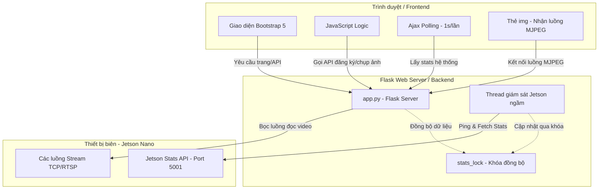

# Hệ thống Giám sát Camera AI (Dashboard) - Tài liệu Dự án Chi tiết

Tài liệu này cung cấp cái nhìn toàn diện về cơ sở hạ tầng, cấu trúc thư mục, cơ chế hoạt động và các tính năng của hệ thống Dashboard Giám sát Camera AI. Mục tiêu là giúp các thành viên trong đội ngũ phát triển (đồng nghiệp, lập trình viên mới) nhanh chóng nắm bắt kiến trúc và phát triển dự án một cách đồng bộ.

---

## 1. Tổng quan & Mục đích Dự án
Hệ thống **AI Camera Dashboard** được thiết kế để làm giao diện trung tâm điều phối, giám sát và quản lý các luồng dữ liệu camera an ninh được xử lý bởi các thiết bị biên (Edge Devices) như NVIDIA Jetson Nano.

### Mục tiêu chính:
*   **Giám sát thời gian thực:** Kết nối và hiển thị đồng thời hoặc chuyển đổi linh hoạt giữa các camera giám sát (hỗ trợ tối đa 4 kênh truyền).
*   **Đo lường hiệu năng biên (Edge Benchmarking):** Hiển thị trực quan tải lượng CPU, RAM, nhiệt độ của thiết bị xử lý Jetson và độ trễ mạng (ping) cùng tốc độ khung hình (FPS) thực tế của từng camera.
*   **Thu thập dữ liệu khuôn mặt (Local Dataset Registration):** Cho phép đăng ký thông tin nhân sự trực tiếp từ webcam cục bộ (laptop/PC) bằng cách chụp 3 góc độ (trước mặt, nghiêng trái, nghiêng phải) để phục vụ huấn luyện mô hình AI nhận diện khuôn mặt sau này.

---

## 2. Kiến trúc Hệ thống & Cơ sở Hạ tầng (Core Infrastructure)
Dự án được xây dựng dựa trên kiến trúc **Client-Server gọn nhẹ** nhưng tối ưu hóa hiệu năng truyền phát video và xử lý đa luồng.



### 2.1. Công nghệ Sử dụng (Tech Stack)
*   **Backend:** Python 3, Flask (Framework Web gọn nhẹ), OpenCV (xử lý khung hình, mã hóa JPEG, kết nối luồng camera).
*   **Frontend:** HTML5 (Cấu trúc ngữ nghĩa), Vanilla CSS (Tùy chỉnh giao diện chuyên sâu), Bootstrap 5 (Hệ thống lưới Responsive và các thành phần UI), FontAwesome 6 (Hệ thống biểu tượng trực quan).

### 2.2. Cơ chế Truyền phát Video (MJPEG Streaming)
Hệ thống sử dụng cơ chế phản hồi nhiều phần **Multipart Response (`multipart/x-mixed-replace; boundary=frame`)** qua giao thức HTTP:
*   Thay vì truyền tải video nặng nề hoặc dùng các giao thức phức tạp như WebRTC/HLS đòi hỏi thiết lập phức tạp, server Flask liên tục đọc các khung hình từ camera qua OpenCV, mã hóa chúng thành định dạng JPEG và gửi liên tiếp về trình duyệt.
*   Trình duyệt chỉ cần một thẻ `` trỏ nguồn (`src`) vào route `/video_feed/<camera_id>` là có thể tự động giải mã hiển thị luồng video thời gian thực với độ trễ cực thấp.

### 2.3. Cơ chế Đa luồng (Multithreading) & Khóa Đồng bộ (Mutex Lock)
Để tránh tình trạng nghẽn hệ thống (blocking) khi xử lý các tác vụ I/O nặng, dự án triển khai đa luồng:
1.  **Luồng chính (Main Thread):** Flask phục vụ các yêu cầu HTTP từ client (tải trang, stream video, nhận diện API).
2.  **Luồng giám sát ngầm (Background Thread - `update_jetson_stats_loop`):** Khởi chạy độc lập dưới dạng `daemon=True`. Cứ mỗi 2 giây, luồng này sẽ thực hiện gửi gói tin ping đo độ trễ và truy vấn HTTP GET tới API đo đạc phần cứng biên của Jetson (`http://192.168.31.102:5001/stats`).
3.  **Khóa đồng bộ (`stats_lock`):** Do dữ liệu trạng thái (`camera_stats`, `jetson_system_stats`) được đọc/ghi đồng thời bởi nhiều luồng (luồng ngầm ghi, luồng xử lý API của Flask đọc), một đối tượng `threading.Lock` được sử dụng như một Mutex để bảo vệ tài nguyên dùng chung, ngăn chặn triệt để lỗi xung đột dữ liệu (Race Condition).

---

## 3. Cấu trúc Thư mục Dự án (Project Directory Structure)

Dưới đây là sơ đồ cấu trúc chi tiết của dự án `ai_camera_dashboard`:

```text
ai_camera_dashboard/
│
├── .venv/                      # Môi trường ảo chứa các thư viện Python (được cấu hình trong .gitignore)
├── .gitignore                  # Chỉ định các tệp tin và thư mục Git bỏ qua không theo dõi
├── README.md                   # Tài liệu hướng dẫn và mô tả dự án này
├── app.py                      # Tệp tin lập trình chính của Backend (Flask + OpenCV logic)
│
├── templates/
│   └── index.html              # Giao diện chính của hệ thống Dashboard
│
└── static/                     # Chứa các tài nguyên tĩnh phục vụ giao diện
    ├── css/
    │   └── style.css           # Các tùy chỉnh CSS riêng (nhấp nháy LIVE, hiệu ứng hover nút, bố cục video)
    │
    ├── captures/               # Thư mục tự động tạo để lưu ảnh chụp nhanh từ các camera giám sát
    │   └── camera_1_*.jpg      # Các ảnh chụp nhanh định dạng JPEG đặt tên theo mốc thời gian
    │
    └── face_registrations/     # Thư mục tự động lưu tập dữ liệu khuôn mặt phục vụ AI
        └── <ten_nhan_vien>/    # Thư mục riêng biệt của từng người, chứa 3 tư thế:
            ├── front.jpg       # Ảnh chụp thẳng trước mặt
            ├── left.jpg        # Ảnh chụp nghiêng sang trái
            └── right.jpg       # Ảnh chụp nghiêng sang phải
```

---

## 4. Các Tính năng Chính & Cách Hoạt Động (Key Features)

| Tính năng | Phía Frontend (Client) | Phía Backend (Server) |
| :--- | :--- | :--- |
| **Giám sát Camera Đa kênh** | Người dùng click chọn các camera (Camera 1 - 4) ở menu trái. Giao diện thay đổi nguồn phát tức thì mà không cần tải lại trang. | Nhận request `/video_feed/<camera_id>`, khởi tạo luồng giải mã `cv2.VideoCapture` qua giao thức FFMPEG tương ứng với camera được chọn. |
| **Đo lường Benchmark Hệ thống** | Cập nhật động mỗi 1 giây thông qua cơ chế Ajax polling. Hiển thị FPS thực tế, độ trễ Ping (ms), tải CPU (%), RAM (%), nhiệt độ (°C) thông qua các thanh tiến trình trực quan. | Luồng ngầm liên tục ping và truy vấn API giám sát phần cứng của Jetson. Cung cấp API endpoint `/api/stats` trả về JSON chứa toàn bộ dữ liệu mới nhất. |
| **Chụp ảnh Giám sát (Snapshot)** | Nút "Chụp ảnh" gửi yêu cầu POST đến hệ thống. Khi chụp thành công, hiển thị thông báo tên file ảnh đã lưu. | Endpoint `/capture/<camera_id>` sao chép frame mới nhất trong bộ nhớ cache (`latest_frames`), ghi file ảnh chất lượng cao vào thư mục `static/captures/`. |
| **Đăng ký Khuôn mặt cục bộ** | Nhập Họ & Tên nhân viên. Sử dụng Webcam cục bộ để hướng dẫn chụp 3 góc độ. Có ảnh xem trước (Preview) ở mỗi góc chụp. Cho phép nhấn vào để phóng to kiểm tra chất lượng. | Nhận gói dữ liệu JSON từ `/api/register_face` chứa chuỗi ảnh mã hóa Base64. Giải mã Base64 thành nhị phân, tự động làm sạch tên người dùng tạo thư mục và ghi các file `front.jpg`, `left.jpg`, `right.jpg`. |

---

## 5. Chi tiết Luồng xử lý Kỹ thuật (Technical Pipelines)

### 5.1. Luồng truyền tải khung hình Video (Video Pipeline)
1.  Trình duyệt yêu cầu luồng: ``.
2.  Flask kích hoạt hàm generator `generate_frames("camera_1")`.
3.  Vòng lặp liên tục:
    *   Đọc khung hình bằng `cap.read()`. Nếu mất kết nối, tự động chuyển trạng thái camera sang `Offline` và thử kết nối lại sau mỗi 2 giây.
    *   Tính toán FPS dựa trên hiệu số thời gian giữa các khung hình.
    *   Ghi đè bản sao khung hình vào biến toàn cục `latest_frames["camera_1"]` phục vụ chụp ảnh tức thì.
    *   Mã hóa khung hình sang dạng nén `.jpg`.
    *   Truyền tải luồng byte qua lệnh `yield` định dạng MJPEG.

### 5.2. Luồng đăng ký dữ liệu khuôn mặt (Face Dataset Pipeline)
1.  Người dùng điền tên "Nguyễn Văn A" và thực hiện chụp 3 ảnh trên giao diện.
2.  Trình duyệt sử dụng API Camera HTML5 để chụp ảnh từ thiết bị nội bộ, chuyển đổi dữ liệu thành các chuỗi **DataURL chứa mã hóa Base64**.
3.  Khi nhấn **"Lưu Bộ Ảnh"**, Frontend gửi yêu cầu `POST` dạng JSON tới `/api/register_face` chứa tên và 3 chuỗi Base64 đại diện cho 3 bức ảnh.
4.  Backend thực hiện:
    *   Chặn lọc tên thư mục bằng Regex để loại bỏ ký tự đặc biệt có hại cho hệ thống tệp tin (`\/*?:"<>|`).
    *   Tự động tạo thư mục: `static/face_registrations/Nguyen_Van_A/`.
    *   Bóc tách phần đầu dữ liệu Base64 (`data:image/jpeg;base64,...`), tiến hành giải mã chuỗi còn lại bằng thư viện `base64`.
    *   Ghi trực tiếp file ảnh nhị phân ra đĩa cứng dưới các tên `front.jpg`, `left.jpg`, `right.jpg`.

---

## 6. Hướng dẫn Cài đặt & Khởi chạy Dự án (dành cho Lập trình viên)

### Bước 1: Chuẩn bị Môi trường
Di chuyển vào thư mục dự án và tạo môi trường ảo Python nhằm tránh xung đột thư viện hệ thống:
```bash
# Di chuyển vào thư mục dự án
cd ai_camera_dashboard

# Tạo môi trường ảo (Virtual Environment)
python -m venv .venv

# Kích hoạt môi trường ảo:
# Trên Windows:
.venv\Scripts\activate
# Trên macOS/Linux:
source .venv/bin/activate
```

### Bước 2: Cài đặt các Thư viện cần thiết
```bash
pip install flask opencv-python
```

### Bước 3: Cấu hình Địa chỉ IP Thiết bị Biên
Nếu địa chỉ IP của NVIDIA Jetson Nano hoặc các Camera IP trong mạng LAN của bạn thay đổi, hãy mở file `app.py` và cập nhật các hằng số cấu hình ở đầu trang:
```python
# app.py (Dòng 18-23)
VIDEO_SOURCES = {
    "camera_1": "tcp://<IP_MỚI_CỦA_JETSON>:5005",
    "camera_2": "tcp://<IP_MỚI_CỦA_JETSON>:5006",
    # ...
}
```
Và cập nhật địa chỉ IP của thiết bị Jetson trong hàm đo đạc hiệu năng:
```python
# app.py (Dòng 53 & Dòng 71)
ping_cmd = ["ping", "-n", "1", "<IP_MỚI_CỦA_JETSON>"]
req = urllib.request.Request("http://<IP_MỚI_CỦA_JETSON>:5001/stats")
```

### Bước 4: Khởi chạy Ứng dụng
```bash
python app.py
```
Mở trình duyệt và truy cập `http://localhost:5000` để trải nghiệm giao diện.

---

## 7. Các Lưu ý Quan trọng khi Làm việc Chung (Collaboration Rules)
Nhằm giữ cho mã nguồn luôn sạch, chạy ổn định và dễ bảo trì, các lập trình viên cần tuân thủ:

1.  **Luôn giải phóng tài nguyên hệ thống:** Khi thao tác với camera hoặc luồng phát trong các hàm thử nghiệm độc lập, hãy đảm bảo đặt mã lệnh giải phóng `cap.release()` trong khối lệnh `try...finally` để tránh việc camera bị khóa cứng ở mức hệ điều hành.
2.  **Đồng bộ hóa luồng dữ liệu:** Bất kỳ thuộc tính nào được thêm mới vào biến trạng thái dùng chung (`camera_stats` hoặc `jetson_system_stats`) mà được truy cập chéo giữa các luồng đều phải được đặt trong khối lệnh `with stats_lock:` để đảm bảo an toàn luồng (thread safety).
3.  **Tối ưu hóa dung lượng truyền tải:** Tránh thực hiện các phép biến đổi ảnh phức tạp hoặc tính toán AI nặng nề trực tiếp trên luồng truyền phát video của Flask. Mọi tác vụ suy luận AI (Inference) nên được xử lý trực tiếp tại thiết bị biên Jetson trước khi đẩy luồng video sạch/đã vẽ khung nhận diện về Dashboard.
4.  **Bảo mật dữ liệu đăng ký:** Ảnh đăng ký khuôn mặt chứa thông tin nhạy cảm của người dùng. Các thư mục ảnh được lưu trữ trong `static/face_registrations` cần được phân quyền đọc/ghi phù hợp trên môi trường production thực tế.

---
*Tài liệu được cập nhật và duy trì bởi Đội ngũ Phát triển Hệ thống Camera AI.*
